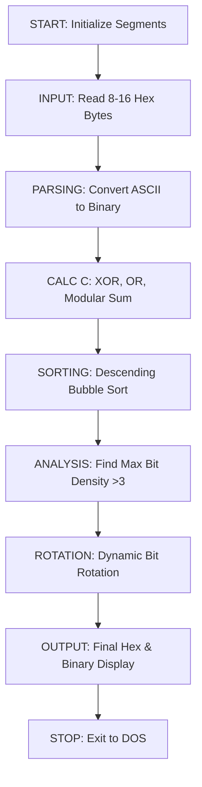

# SecureStream-86

A comprehensive 16-bit Assembly project for the 8086 architecture developed using TASM and TLINK. This program performs interactive data processing, bitwise manipulation and data rotation on a user-provided stream of hex octets.

## Features

- **Interactive I/O:** Utilizes DOS interrupts for clear user communication and buffered input.
- **Bitwise Cryptography (Word C):** Generates an unique 16-bit control word based on XOR, OR, and modular arithmetic.
- **Data Sorting:** Implements a descending Bubble Sort algorithm on the byte array.
- **Bit Density Analysis:** Identifies high-density bytes (where bit count of '1' > 3).
- **Circular Data Rotation:** Performs dynamic left-rotations on each byte based on its own initial bit values.

#### Security Token (Word C) Architecture
The 16-bit control word **C** is deterministically generated through a three-pass logic:

* **Bits 0-3 (Logic XOR):** Calculated by performing an XOR operation between the **Most Significant Nibble** (first 4 bits) of the first byte and the **Least Significant Nibble** (last 4 bits) of the last byte in the sequence.
* **Bits 4-7 (Logic OR):** Result of an accumulative OR operation performed on bits 2-5 of every byte in the input array.
* **Bits 8-15 (Modular Sum):** The upper byte of **C** stores the sum of all input octets modulo 256.

## Project Structure

The code is designed modularly to ensure high scores in code quality and reusability:
- `MAIN.ASM`: Handles the program flow, user interface messages, and top-level logic.
- `PROCEDURES.ASM`: Contains the heavy-lifting subroutines (Parsing, Sorting, Calculating C and Rotations).



## How to Run:

Assemble the modules:
   ```bash
   1. tasm main.asm
      tasm proc.asm

   2. tlink main.obj proc.obj

   3. main.exe
